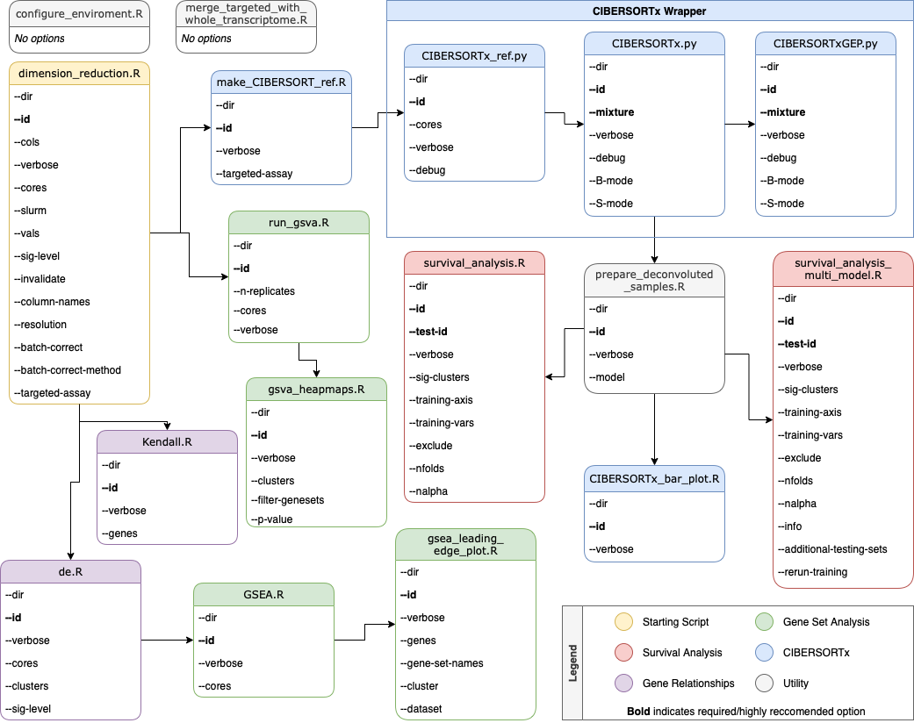

[](https://open.vscode.dev/hwanglab/AML_biomarkers)

# Biomarker Analysis for Single-Cell Data

## Installation/Setup

### Getting Setup
Renv is used for this project. 
To quickly initialize the R enviorment, run `./cli/configure_enviorment.R`. 
There is also a docker container availible at schaunr/amlbiomarkers. 
See more under [Running the Pipeline](###running-with-docker)

#### Manual Setup with renv
To install all the R packages just use `renv::restore()`. 
The renv autoloader should automatically boostrap renv and `renv::restore()` will take care of installing all the correct package versions, although you will have to install system dependencies yourself.

#### Getting Setup on an HPC
Singlularity was not trivial to use, therfore I directly loaded modules. The following should be added to your `.bashrc` file or prepend to any submission script (note, versions may differ across systems):
```bash
# Set up R enviorment
module load hdf5-serial/1.12.0
module load magick
module load fftw3/3.3.8
module load R/4.1.0
module load gdal/3.2.2
module load proj/7.2.1
module load geos/3.8.2
module load python/3.7-2019.10

# CIBERSORT options
export TOKEN={Token from website}
export EMAIL={email address used on website}
```
Then follow the directions under "Getting Setup"

## Running the Pipeline

### General Overview
The pipeline is stored in the cli directory. 
The functions each take an id which will automatically handle inputs and outputs. 
An invocation file is created if not present and will contain the arguments used at runtime. 
CLI functions cache some of their outputs to make repeated runs quicker. 
All outputs are saved, however, when cached, the expressions are only rerun if the data changes.

### Data Required
Some external datasets are required. TARGET AML, BeatAML, and TCGA LAML are all used during deconvolution. 
Many different clinical information tables are also required. 
These are all found in `/clinical_info`

### Running with Docker
A docker image can be found at `schaunr/amlbiomarkers`. To quickly get setup and explore the container run:
`docker run -it schaunr/amlbiomarkers bash`. 
This will download the image, and open up to a terminal. 
The image `schaunr/amlbiomarkers:${TAG}` is multiarchitecture (x64 and ARM/Apple Silicon).
However, there will be no data inside the image. 
To setup the entire pipeline, you'll need to bind mount several directories.
```bash
TAG="latest"

# Run using a script name as arguments
docker run \
    -v "$(pwd)"/clinical_info:/clininfo \
    -v "$(pwd)"/outs:/outs \
    -v "$(pwd)"/plots:/plots \
    schaunr/amlbiomarkers:{$TAG} \
    survival_analysis.R \
    -i run1 \
    -I EFS \
    -V 'c(matches("^Year|^Age|^Overall"), where(is_character))' \
    -a 'Event Free Survival Time in Days' -E

# Run interactively in the terminal
docker run \
    -it \
    -v "$(pwd)"/clinical_info:/clinical_info \
    -v "$(pwd)"/outs:/outs \
    -v "$(pwd)"/plots:/plots \
    schaunr/amlbiomarkers:{$TAG} \
    bash
```
You can also use `schaunr/amlbiomarkers:${TAG}` in a non-interactive mode by passing the name and options associated with a CLI script and the container will exit after completion. See first example above.

### CLI Function Information

#### Function Descriptions
See [Pipeline Flow Chart](##pipeline-flow-chart) for details on connecting the various functions and a list of options for each script.  

**dimension_reduction.R:**
    Subsets the data and runs dimension reductions (UMAP, PCA) and does batch correction using Harmony. 
    Then finds clusters that are different between groups.
    The results are cached.

**make_CIBERSORT_ref.R:**
    Prepares data to upload to CIBERSORTx for reference creation. 
    The results are cached.

**deconvolute.R:**
    Prepares references for deconvolution and runs several deconvolution methods.
    The results are cached.

**CIBERSORTx.py:**
    Runs the CIBERSORTx algorithm on the data.

**prepare_deconvoluted_samples.R:**
    Annotates deconvoluted samples with clinical information. Selects desired deconvolution method. 

**run_gsva.R:**
    Runs a GSVA on the clusters.
    The results are cached.

**run_cellphone.R:**
    Runs the CellPhoneDB algorithm on the clusters.
    The results are cached.

**survival_analysis.R:**
    Does a survival analysis using the chosen parameters.

**survival_analysis_multi_model.R:**
    Does a survival analysis using LASSO, Random Forests, KNN Regression, Support Vector Regression, and Neural Network Regression

**de.R:**
    Does a differential expression per cluster

**merge_targeted_with_whole_transcriptome.R:**
    Merge unfiltered raw counts with existing Seurat object and normalize

#### Common CLI Arguments

`--id`: An arbitrary ID to give the run. 
Should be consistant across all functions. 
Will be a subfolder of `--dir`.

`--dir`: What directory to use as the run directory. 
Defualts to the current directory.

`--verbose`: How should messages be printed.

`--cores`: How many cores should be used for multicore processing. 
This uses the future framework.

`--help`: will print help for each CLI function.  

`--info`: information for column names and values for survival analysis. 
Has a specific format of "Dataset:option=value:...". 
Potential options are below. You can also provide the path to a `json` file with the following format:

```json
"Dataset": {
        "option": "value",
        "option2": "value",
        ...
    }
```

|Option   |Decription
|:-------:|----
|efs      | Column containing the survivial information
|wbc      | Column containing % White Blood Cells, not used currently
|status   | Column containing the events 
|event    | Value in status to determine an event has occured 
|not_event| Value in status to determine an event has *not* occured. All other values in status will be considered an event. 

## Pipeline Flow Chart

Below is a flow chart that shows the prerequesites for each script. Color is provided to organize the scripts  into several different categories.

## Future Goals
- Simplify Clinical Annotation sheets
- Clear Downloading of External Datasets
- Master Pipeline Runner, i.e. Martian, NextFlow...
